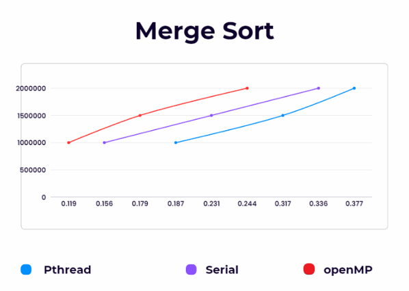
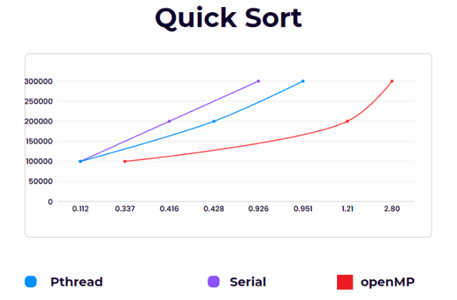
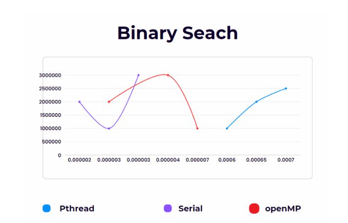

    # Parallel Programming - Sorting Algorithm Comparison

This project compares the performance of various sorting algorithms when implemented using different parallel programming paradigms: **Pthreads**, **OpenMP**, and **Serial** execution.

> **Course**: Operating Systems  
> **Section**: BSR-4C / BCS-4N  
> **Team Members**:  
> - K225018 Aheed Khan  
> - K225024 Muhammad Hadi Shahid  

## 📘 Overview

Sorting algorithms like Merge Sort, Quick Sort, and Binary Search are fundamental in computing. With the shift toward multi-core systems, it's crucial to evaluate how well these algorithms perform under parallelized environments compared to serial implementations.

## 🎯 Objectives

- Implement Merge Sort, Quick Sort, and Binary Search using:
  - Pthreads (POSIX threads)
  - OpenMP
  - Serial Execution
- Measure performance over various input sizes and configurations
- Compare efficiency and scalability across different approaches
- Document and analyze the findings

## 🧠 Algorithms & Performance Findings

### 1. Merge Sort

Parallel merge sort showed significant performance improvement. Threads were able to operate independently after splitting the data, reducing total execution time.



### 2. Quick Sort

Quick sort exhibited moderate gains with parallelism, though not as significant due to its partitioning dependency.



### 3. Binary Search

Binary search did not benefit much from parallelization because it is inherently a logarithmic algorithm with minimal computational load.




## 🧾 Conclusion

- **Merge Sort** performed best with parallelization (especially using Pthreads).
- **Quick Sort** showed limited parallel efficiency.
- **Binary Search** had negligible performance gain from parallelization.
- **Serial execution** outperformed parallel in simpler tasks due to overhead in thread creation and management.
- **Virtual Machine Testing** might have limited true parallel performance.
- Fewer threads sometimes led to better results due to reduced overhead.

## 🛠️ How to Run

```bash
# Compile Pthreads version
gcc -o merge_sort_pthreads merge_sort_pthreads.c -lpthread

# Compile OpenMP version
gcc -fopenmp -o merge_sort_openmp merge_sort_openmp.c

# Compile Serial version
gcc -o merge_sort_serial merge_sort_serial.c

# Run with appropriate input
./merge_sort_pthreads
